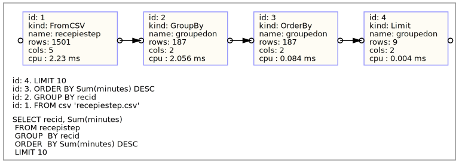

# Table Algebra

(This is partly very experimental)

This package is a kind of workbench for doing relational algebra on flat files, like ``CSV``,  without ``SQL`` and without an ``SQL``-engine but
using a ``RUST`` engine and library of methods for implement the known algebra.

```sql
1. WHERE (restrict)
2. SELECT (project) 
3. JOIN (product, join)
4. INTERSECT, UNION, DIFFERENCE
5. GROUP BY
6. ORDER BY
7. LIMIT and DISTINCT
8. RECURSIVE
8. With Subquery...
```

## Audiance

1. For preprocessing (``JOIN, WHERE, SELECT``) of ``CSV`` files as input before updating your real ``SQL`` database or for getting a reduced ``CSV`` to your spreadsheet.  Avoid clutter of huge ``CSV`` files into your databas.
2. Newbies to ``RUST``. Proper ``Result`` pattern, simple class/object, good introduction to usage of ``RUST`` standard collections.
3. Education ?
4. Me my self. What can be done using plain ``RUST`` only. Experiments with design patterns and standard collections.
5. I think this kit could be a useful workbench for evaluating algorithms and solutions in general but in join especially. The ``EXPLAIN`` gives digits on cpu, number of rows, number of columns etc. Wihout index though. 
6. ``SVG`` coder/designer using ``RUST``.
7. ``EXPLAIN`` maintainers in most SQL suppliers I think. New demands.

## Included

1. A ``RUST`` library with one class and object methods doing all algebra. Just copy and modify examples and build runnables.
2. If not sufficient add own methods!
3. Very nice ``EXPLAIN`` output with timings, volumes etc. Drop any of the .svg from examples into your browser.
4. An outline pattern for design of process ordering.
5. An odd scatter x-y plot output facility.

## Not included

1. ``SQL`` parsing. SQL is used for description only.
2. Index.
3. Update.
4. Different column formats. All is text.
5. Documentation.
6. This is not a general Command Line Tool on ``CSV`` files. You have to be your own tailer. Look into examples.
7. Batteries not included.


## Example
### About the source
1. On ``src/bins/binrecepie/`` you have some operations on a recepie collection.
2. On ``src/bins/binchrisdate/`` you have a lot of examples on how use the diffrent operations on tables. The data is from Chris Date books but with more rows.
3. On ``src/bins/bindemo/`` there is a ready to run demo on recepies.
So, build the target and run and you get the 10 recepies taking most time to cook. From 200 recepies and 450 infredients. Traditinal SQL is

```SQL
SELECT recid, Sum(minutes)
 FROM recepistep 
 GROUP  BY recid
 ORDER  BY Sum(minutes) DESC
 LIMIT 10
```

An **outline** would look like (will compile and run)

```RUST
let _outline = Table::table_from_dummy()
	.table_from_outline("FROM CSV recepiestep", "Params...later on")
	.table_groupby_outline("GROUP BY recid and aggr->Sum(minutes)", "Params")
	.table_orderby_outline("ORDER BY Sum(minutes) DESC", "Params")
	.table_limit_outline("LIMIT 10", "Params")
	.table_select_outline("SELECT recid, Sum(minutes)", "Params");

```

```sh
> cargo build --all --release
> ./target/release bindemo --tty
+-------+--------------+
| recid | Sum(minutes) |
+-------+--------------+
|    93 |         2409 |
|   138 |          912 |
|   101 |          295 |
|    60 |          217 |
|    86 |          210 |
|    18 |          185 |
|    85 |          165 |
|    29 |          127 |
|    77 |          120 |
+-------+--------------+

Job total cpu-time 10.109 ms
```
You can get get a ``CSV`` output as well

```sh
> ./target/release bindemo --csv
"recid","Sum(minutes)"
"93","2409"
"138","912"
"101","295"
"60","217"
"86","210"
"18","185"
"85","165"
"29","127"
"77","120"
Job total cpu-time 8.826 ms
```

And of course an explanation ``EXPLAIN`` of the process

```sh
> ./target/release/bindemo --svg >readme_1.svg
Job total cpu-time 9.419 ms
```

Drop the ``.svg`` file into your browser and you get an ``EXPLAIN``. With kind of operation, number of rows, number of columns and cpu usage.



There are more ``EXPLAIN`` covering joins and select with subqueries in the examples from ``src/bins/binchrisdate/``.
## Design objectives
This kit is a design along

1. Class and object. Not very RUST but understandable and sufficinet. Constructors are of kind ``Table::from_...(`` and object methods are named ``table_...(``. Such method calls createa an new ``Table`` object
2. A ``Table`` object can be seen as hosting of a materialized table.
2. ``Result`` all the way. The outermost caller can take care of improper result. Heavy use of the wonderful ?
3. Logging of each algebraic transformation giving input to the ``EXPLAIN``
4. The ``JOIN``, on equi, is implemented with a HashMap with two bags. One bag for records from left and one bag for records from right. Very simple merge than. For INNER, LEFT, RIGHT and OUTER. If there is no equi a full product is performed. But there is of course possibility filter on left and right leg if suitable.
5. When passing parameters to a function one can end up in 

>		table_groupby(
>             "groupedon",
>             Some(vec!["recid"]),
>             vec![vec!["count", "*", "COUNT(*)"]],
>             None,
>             None)

 Hard to understand. A better way is something like (**named parameters**)

>  		table_groupby(
>            Params2GroupBy {
>                out_table: "groupedon",
>                groupon: Some(vec!["recid"]),
>                aggrcols: vec![vec!["count", "*", "COUNT(*)"]],
>                custom_aggr: None,
>                cond_having: None,
>            },
>        )

Much more understandable! And pretty.

6 Most example are executed in one breath. Method chaining. Of ``Result`` Types. Just one (the result) variable. Closures body as parameters. Quite interesting but also preferable. Have a look into example sources.
 
7 All results are ``RUST`` computational so you can treat the final rows as a plain collection in your program.

## Usage
Build the package

```sh
cargo build --all
```

Try the demo

```sh
./target/release bindemo --tty | --svg | --csv

```

For evaluation of examples look in 

```sh
./bins/binchrisdate/databigger/bygg.sh
```
The pattern is

```
./target/release/binchrisdate datafolder testname >some.svg
```

The source for the the definition of ``Table`` class is located in one file and then thera are one folder and file for each method / algebraic opration. You can easy pick a small managable set.

## Enhacements

Implement your own constructor ``from_anysource_to_1NF`` if you have a source of whatever (json, XML, private structured...). A ``curl`` reader with a ``csv`` parser maybe. Be careful with security issues though using ``curl``.

Implement your own ``table_select_enum(...)`` which will enumerate one extra column.

Extend the join to cover lateral join.

Implement ``AND`` , ``OR`` in subquery expressions.

Optimize subquires. Result is only dependent outer values. Cache result for each key.

Optimize subquires. Do early termination, on first hit, on certain set operation. ``IN, NOT IN, EXIST, NOT EXIST``, some ``ANY``.

When import from ``CSV`` add one more index on the fly. And extend the present ``table_join`` with new algorihms and elaborate the outcome of choices and behaviors. The ``EXPLAIN`` is a very good documentation on the result!

Why not make an ``Table::from_CURL`` so you can import from CURL and using CSV as row transformer. Thus avoiding temporary storage. ``CURL`` can be used on local ``URL`` too.


## Subquery
At certain positions in a sql statement one can use subqueris in order to produce a result.

Thoose positions are

1. As a tableconstructor in a ``FROM`` list.
2. As a setconstructor in an conditinal expression.
3. As a single column value constructor in a ``SELECT`` list.
4. As a plain tableconstructor like (``SELECT`` ...) ``UNION`` (``SELECT`` ...).
5. In ``HAVING`` of cource. (Not covered here. Can be rewritten).
6. As in ``LATERAL`` joins. Not covered here.
7. As in ``WITH RECURSIVE``.


### Static (independent) or dynamic (dependent) subqueris

As we can see the subquries can be any legal ``SQL`` query. But from execution angel they can be divided in two groups.

* Independent of the surrounding query. That is they can be processed once an the result can be stored as a temporary resulset. The (1) ``FROM`` is always of this kind.
* Dependent of the surrounding query. Normally the (3) single column value constructor is of this kind.

In the (3) setconstructor in a conditinal expression the subquery can be dependent or not

```SQL
SELECT A,B,(<[dep]<subq_giving_one_value>>)
FROM T,(<subq_set>)
WHERE C IN (<[dep]><subq_set>)
```

It is as simple as that. Either a onceonly (independent) process with temporary result or processeing a complete query with some kind out outer surrounding row (dependent)!
By the way an CTE, Common Table Expression, is produced via ``Table::from_``. The ``Recursive`` alternative has it's own method.

And then, in this design, treat the very outmoust ``SELECT`` as an dependent subquery with an empty outer dependency! (Could be used for binding parameters).


## Psuedo Grammar for where

```BNF
WHERECLAUSE ::= where COND [ (and | or ) COND ].
COND        ::= (LEFTSIDE COMPARATOR) | ((EXISTS | UNIQUE) setofrows).
LEFTSIDE    ::= onerow.
COMPARATOR  ::= EQKIND | SETKIND.
EQKIND      ::= COMPOPER onerow.
COMPOPER    ::= '=' | '>=' | '<=' | '<>' 
SETKIND     ::= ( [ NOT ] in setofrows) | (COMPOPER ( ALL | ANY | SOME ) setofrows) 
```

Look into the following examples in ``src/bins/binchrisdate/``

```sh
ex_where.rs
ex_where_eq_kind_depsubq.rs
ex_where_eq_kind_once.rs
ex_where_exist_kind_depsub.rs
ex_where_set_kind_once.rs
```

has resulted in the following parameters for where ( C-like )

```RUST
struct Params2Where 
{
  super_obj: Option<& Table>,
  super_row: Option<TableRow>,
  simple_or_complex: 
    enum 
    {
      SimpleCond(fn(...) -> bool),
      ComplexCond( 
        struct 
        {
        the_eval_subq_result_function: fn(...) -> bool
        once_or_sub: 
          enum
          {
            OnceSub(Table),
            ADependentSubQuery 
            {
              the_sub_query_func: SubQueryFunction,
              extra_tables: & Vec<& Table>
            }
          }
        }
      }
    }
```

Three variants

1. ``call simplecond with where-filter``
2. ``call complexcond using tables and with the_eval_subq_result_function-filter``
3. ``call complexcond using subquery+extra_tables and with the_eval_subq_result_function-filter``
